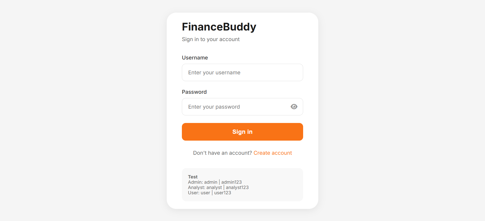
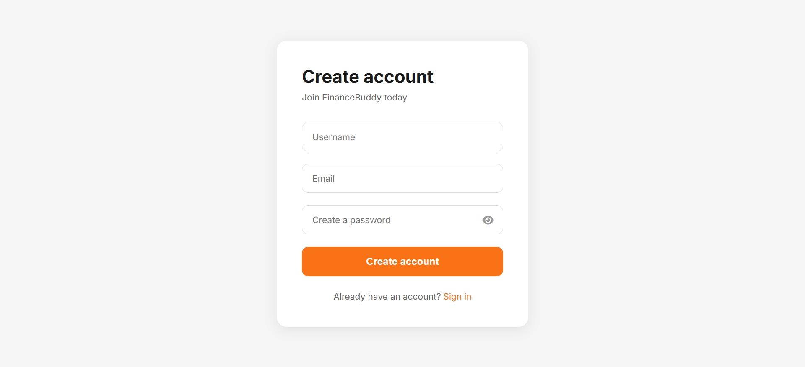
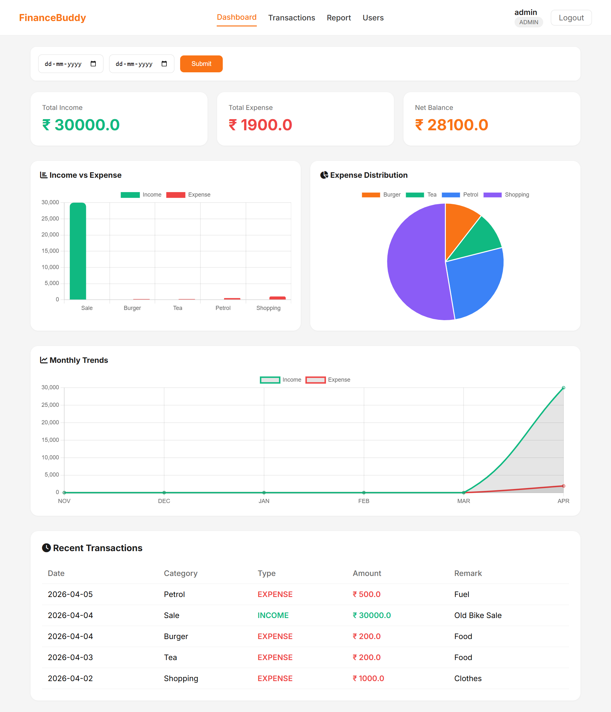
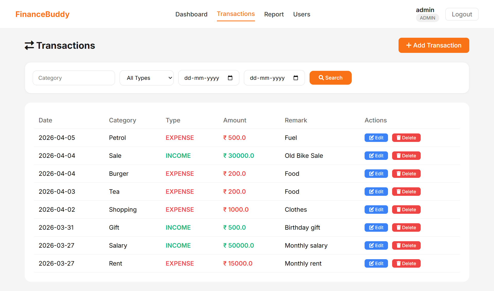
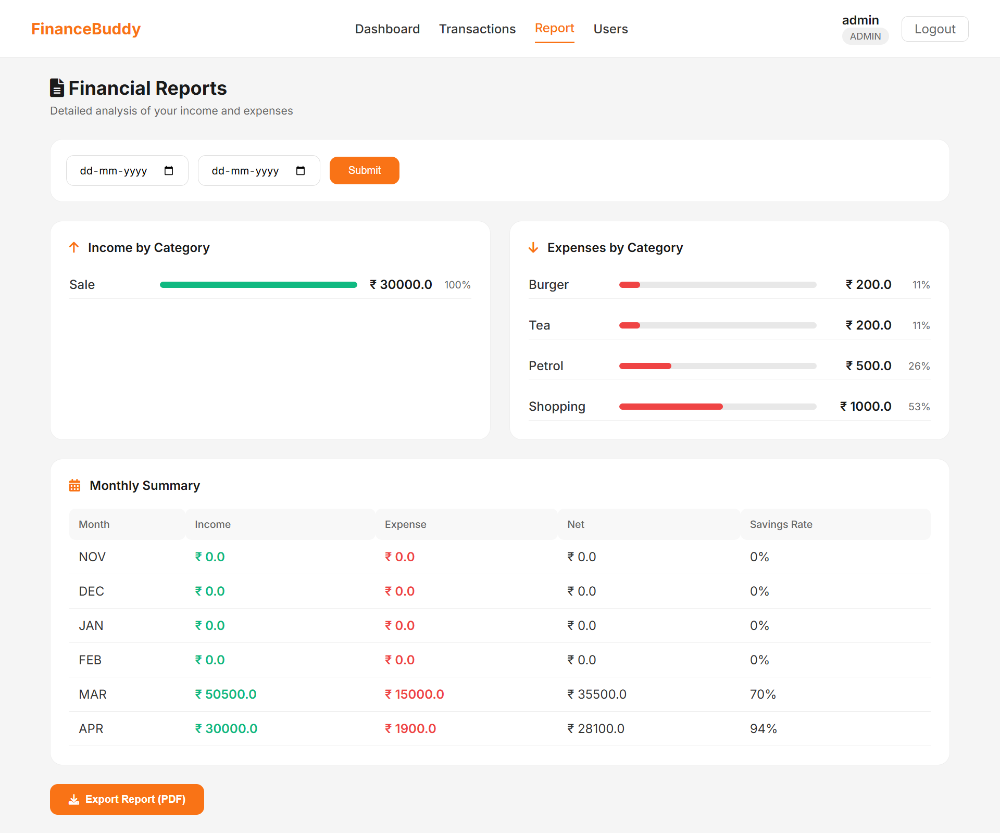
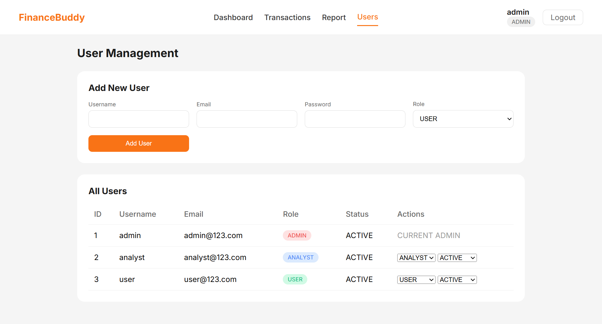

# FinanceBuddy - Personal Finance Management System

## 📌 Project Overview

**FinanceBuddy** is a web-based personal finance management application developed using **Spring Boot** and **JSP**.  
It helps users manage and track their **income**, **expenses**, and **financial reports** efficiently while implementing **role-based access control** for secure access.

---

## 🚀 Key Features

- User Authentication (**Login / Register**)
- Role-Based Access Control (**Admin, Analyst, User**)
- Transaction Management (**Add, Edit, Delete, View Reports**)
- Dashboard with Charts:
  - Bar Chart
  - Pie Chart
  - Line Chart
- Financial Reports with Category-wise Summary
- User Management (**Admin Only**)
- Date Filter for Transactions and Reports

---

## 👥 Roles and Permissions

### 🔹 Admin
- View all transactions
- Add transactions
- Edit transactions
- Delete transactions
- View dashboard
- View reports
- View registered users
- Change user roles

### 🔹 Analyst
- View all transactions
- Add transactions
- Edit transactions
- View dashboard
- View reports

### 🔹 User
- View own transactions
- Add own transactions
- Edit own transactions
- Delete own transactions
- View dashboard
- View reports

---

## 🧪 Test Credentials

### Admin
- **Username:** `admin`
- **Password:** `admin123`

### Analyst
- **Username:** `analyst`
- **Password:** `analyst123`

### User
- **Username:** `user`
- **Password:** `user123`

---

## 🛠 Tech Stack

| Layer | Technology |
|------|------------|
| Backend Language | Java 17 |
| Framework | Spring Boot 3.5.13 |
| Build Tool | Maven |
| Frontend | HTML, CSS, JSP, JavaScript |

---

## ⚠ Important Note

This project currently uses **In-Memory Mock Storage** using Java Collections such as:

- `ArrayList`
- `Map`

### Current Limitations
- No database (like MySQL) is required
- All data is stored only during application runtime
- Data will be lost when the application stops or restarts

### Future Scalability
The application can be easily extended and connected to a real database like **MySQL** by:
- adding **JPA dependencies**
- modifying the **service layer**

---

## ▶️ How to Run the Project

### Requirements
- Java 17 or higher
- Maven
- Eclipse / IntelliJ IDEA
- Any modern web browser

### Steps to Run
1. Download the source code from the GitHub repository or use the provided assignment ZIP file.
2. Extract the ZIP file to any location on your system.
3. Import the project into **Eclipse** as an **Existing Maven Project**.
4. Run `FinancebuddyApplication.java` as a **Spring Boot App**.
5. Open your browser and go to: http://localhost:8080/login

## 📁 Project Structure

Click to expand full project structure

<pre>
financebuddy/
├── src/main/java/com/finance/financebuddy/
│   ├── FinancebuddyApplication.java
│   ├── controller/
│   │   ├── AuthController.java
│   │   ├── DashboardController.java
│   │   ├── TransactionController.java
│   │   ├── UserController.java
│   │   └── ReportController.java
│   ├── service/
│   │   ├── UserService.java
│   │   ├── TransactionService.java
│   │   └── DashboardService.java
│   └── model/
│       ├── User.java
│       ├── Transaction.java
│       └── Role.java
├── src/main/webapp/WEB-INF/views/
│   ├── login.jsp
│   ├── register.jsp
│   ├── dashboard.jsp
│   ├── transactions.jsp
│   ├── add_transaction.jsp
│   ├── edit_transaction.jsp
│   ├── users.jsp
│   ├── reports.jsp
│   ├── index.jsp
│   └── navbar.jsp
├── src/main/resources/
│   └── application.properties
├── screenshots/
│   ├── login.png
│   ├── register.png
│   ├── dashboard.png
│   ├── transactions.png
│   ├── reports.png
│   └── users.png
├── README.md
└── pom.xml
</pre>

## 📄 Pages
1. Login Page
  Clean interface with demo username and password
  Register option for new users
2. Dashboard
  View income, expense, and net balance
  Visual charts
  Recent transactions table
  Date filter support
3. Transaction Page
  List all transactions with edit/delete options
  Add new transaction button
  Role-based actions:
  Analyst can edit but cannot delete
  Admin has full access
4. Reports Page (Analyst / Admin Only)
  Income by category with progress bars
  Expense by category with progress bars
  Monthly summary table
  PDF export option
5. Users Page (Admin Only)
  View all users
  Add new user with role
  Edit user role and status

##💡 Important Points
Mock Storage — Uses Java Collections instead of a real database for simplicity
No Password Encryption — Passwords are stored as plain text for testing only
Analyst Cannot Delete — Prevents accidental data loss
User Can Delete Own Transactions — Gives full control over personal records
Dynamic Charts — All charts are generated from actual transaction data

## 🎥 Project Demo Video

Click the image below to watch the full project demo:

## 🖼 Screenshots

### 🔐 Login Page

### 📝 Register Page

### 📊 Dashboard

### 💸 Transactions Page

### 📈 Reports Page

### 👥 Users Page

